<p align="center">
  
  
  
  
  
  
  
  
</p>

<h1 align="center">🛡️ SOCVerse – Attack Simulation & Detection Engineering Lab</h1>

<p align="center">
  <a href="#-project-overview">Overview</a> •
  <a href="#-architecture">Architecture</a> •
  <a href="#-infrastructure">Infrastructure</a> •
  <a href="#-technology-stack">Tech Stack</a> •
  <a href="#-repository-structure">Repo Structure</a> •
  <a href="#-setup-guide">Setup Guide</a> •
  <a href="#-attack-simulations">Attacks</a> •
  <a href="#-skills-demonstrated">Skills</a>
</p>

---

## Project Overview

**SOCVerse** is a comprehensive cybersecurity home lab environment designed to simulate real-world Security Operations Center (SOC) workflows. This project demonstrates end-to-end capabilities in threat detection, attack simulation, log analysis, and incident investigation — all mapped to the **MITRE ATT&CK** framework.

The lab leverages **Wazuh SIEM** as the centralized monitoring platform, with multiple endpoints (Windows and Linux) serving as both attack targets and monitored assets. Attack simulations are conducted from a dedicated **Kali Linux** attacker machine to emulate adversary behavior across the kill chain.

### Project Goals

- Build a fully functional SOC monitoring environment with centralized SIEM
- Simulate real-world cyber attacks across Windows and Linux endpoints
- Develop custom detection rules and alert logic in Wazuh
- Map all attack simulations to MITRE ATT&CK techniques and tactics
- Document the complete investigation lifecycle for each incident
- Create portfolio-grade documentation suitable for professional presentation

### Learning Outcomes

- Understanding of SOC Tier 1/Tier 2 analyst workflows
- Hands-on experience with SIEM deployment, configuration, and tuning
- Proficiency in log analysis across Windows Event Logs, Sysmon, and Linux syslog
- Practical knowledge of attack methodologies and adversary emulation
- Detection engineering — writing and tuning correlation rules
- Incident investigation and response documentation

---

## Architecture

### Network Topology

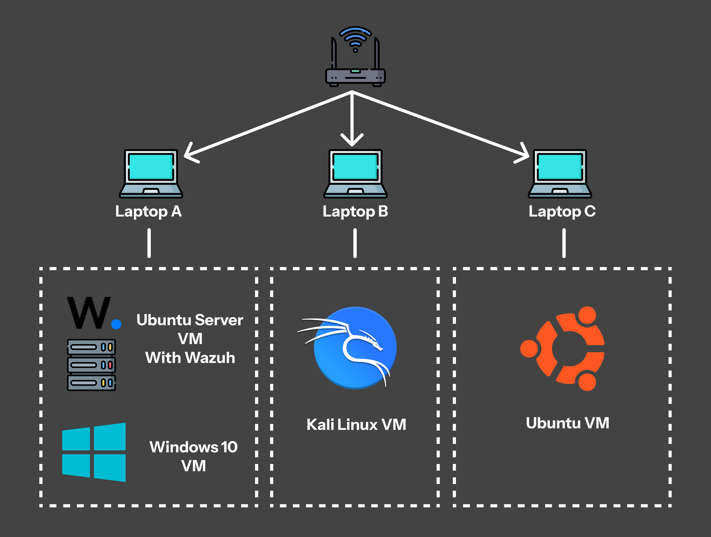

### ASCII Network Diagram

```
┌─────────────────────────────────────────────────────────────────────────────┐
│                        SOCVerse Lab Network (Bridged)                       │
│                           Subnet: 192.168.1.0/24                            │
├─────────────────────────────────────────────────────────────────────────────┤
│                                                                             │
│   ┌─────────────┐     ┌─────────────────┐     ┌─────────────────┐           │
│   │  LAPTOP A   │     │   LAPTOP B      │     │   LAPTOP C      │           │
│   │ (Host: Win) │     │ (Host: Win)     │     │ (Host: Ubuntu)  │           │
│   └──────┬───┬──┘     └───────┬─────────┘     └───────┬─────────┘           │
│          │   │                │                       │                     │
│          │   │                │                       │                     │
│   ┌──────▼──┐ ┌──────▼──┐  ┌─▼───────────┐  ┌───────▼─────────┐             │
│   │  VM 1   │ │  VM 2   │  │    VM 3     │  │      VM 4       │             │
│   │ Wazuh   │ │ Win 10  │  │ Kali Linux  │  │ Ubuntu Desktop  │             │
│   │ Server  │ │Endpoint │  │  Attacker   │  │   Endpoint      │             │
│   │ (SIEM)  │ │(Victim) │  │             │  │   (Victim)      │             │
│   │         │ │         │  │             │  │                 │             │
│   │ Ubuntu  │ │ Wazuh   │  │ Nmap,Hydra  │  │  Wazuh Agent    │             │
│   │ Server  │ │ Agent + │  │ Metasploit  │  │  Monitored      │             │
│   │ 26.04   │ │ Sysmon  │  │ Nikto, etc. │  │  Ubuntu 26.04   │             │
│   └────┬────┘ └────┬────┘  └──────┬──────┘  └───────┬─────────┘             │
│        │           │              │                  │                      │
│   ─────┴───────────┴──────────────┴──────────────────┴──────────────        │
│                    Bridged Network (192.168.x.0/24)                         │
│                                                                             │
│   ┌──────────────────────────────────────────────────────────────┐          │
│   │                      DATA FLOW                               │          │
│   │  Kali ──attack──▶ Win10/Ubuntu ──logs──▶ Wazuh Server       │          │
│   │                                          │                   │          │
│   │                                    ┌─────▼─────┐             │          │
│   │                                    │ Dashboard │             │          │
│   │                                    │ Alerts    │             │          │
│   │                                    │ Analysis  │             │          │
│   │                                    └───────────┘             │          │
│   └──────────────────────────────────────────────────────────────┘          │
└─────────────────────────────────────────────────────────────────────────────┘
```

---

## Infrastructure

| Host Device | VM | Operating System | RAM | CPU | Storage | Role | Network |
|---|---|---|---|---|---|---|---|
| Laptop A | VM 1 – Wazuh Server | Ubuntu Server 26.04 | 5 GB | 4 vCPUs | 60 GB | Centralized SIEM, Log Collection, Alert Generation, Event Correlation, Dashboard | Bridged |
| Laptop A | VM 2 – Windows Endpoint | Windows 10 | 3 GB | 4 vCPUs | 50 GB | Victim Endpoint, Agent Monitoring, Attack Target | Bridged |
| Laptop B | VM 3 – Kali Linux | Kali Linux 2025.2 | 4 GB | 2 vCPUs | 25 GB | Attack Simulation, Reconnaissance, Exploitation, Adversary Emulation | Bridged |
| Laptop C | VM 4 – Ubuntu Endpoint | Ubuntu Desktop 26.04 | 3 GB | 3 vCPUs | 25 GB | Linux Victim Endpoint, Wazuh Monitoring, Linux Attack Target | Bridged |

---

## Technology Stack

| Category | Technology | Purpose |
|---|---|---|
| SIEM Platform | Wazuh 4.14 | Centralized log management, alerting, and threat detection |
| Log Collector | Wazuh Agent | Endpoint telemetry collection and forwarding |
| Windows Telemetry | Sysmon (System Monitor) | Advanced Windows event logging (process creation, network connections, file changes) |
| Attack Platform | Kali Linux 2025.2 | Penetration testing and adversary simulation |
| Attack Tools | Nmap, Hydra, Metasploit, Nikto, Gobuster | Reconnaissance, brute-force, exploitation |
| Threat Framework | MITRE ATT&CK | Technique mapping and detection coverage analysis |
| Virtualization | VirtualBox / VMware | Virtual machine management |
| Server OS | Ubuntu Server 26.04 | Wazuh SIEM hosting |
| Endpoint OS | Windows 10, Ubuntu Desktop 26.04 | Monitored victim endpoints |
| Documentation | Markdown, GitHub | Professional documentation and version control |

---

## Repository Structure

```
SOC-Home-Lab/
│
├── README.md                                # Main project documentation
├── screenshots/                             # All lab screenshots
│
├── windows-endpoint/                        # Windows attack simulations
│   ├── README.md                            # Windows endpoint overview
│   └── Attacks/                             # Detailed Windows attack reports
│       ├── attack-01-nmap-scan-README.md    # Nmap reconnaissance report
│       ├── attack-02-bruteforce-README.md   # Brute-force attack report
│       ├── attack-03-powershell-execution-README.md # PowerShell execution report
│       ├── attack-04-persistence-README.md  # Persistence mechanism report
│       └── attack-05-privilege-escalation-README.md # Privilege escalation report
│
└── ubuntu-endpoint/                         # Ubuntu attack simulations
    ├── README.md                            # Ubuntu endpoint overview
    └── Attacks/                             # Detailed Ubuntu attack reports
        ├── attack-01-nmap-scan-README.md    # Nmap reconnaissance report
        ├── attack-02-ssh-bruteforce-README.md # SSH brute-force report
        ├── attack-03-privilege-escalation-README.md # Privilege escalation report
        ├── attack-04-persistence-README.md  # Persistence mechanism report
        └── attack-05-suspicious-file-activity-README.md # Suspicious file activity report
```

---

## Setup Guide

### Table of Contents – Setup

| # | Section | Description |
|---|---|---|
| 1 | [Ubuntu Server Installation](#1-ubuntu-server-installation) | Install Ubuntu Server 26.04 for Wazuh |
| 2 | [Windows Endpoint Setup](#2-windows-endpoint-setup) | Configure Windows 10 victim machine |
| 3 | [Ubuntu Endpoint Setup](#3-ubuntu-endpoint-setup) | Configure Ubuntu Desktop victim machine |
| 4 | [Kali Linux Setup](#4-kali-linux-setup) | Set up attacker machine |
| 5 | [Wazuh Installation](#5-wazuh-installation) | Install Wazuh SIEM on Ubuntu Server |
| 6 | [Wazuh Dashboard Access](#6-wazuh-dashboard-access) | Access the Wazuh web interface |
| 7 | [Agent Enrollment](#7-agent-enrollment) | Enroll endpoints with Wazuh manager |
| 8 | [Wazuh Agent – Windows](#8-wazuh-agent-installation-on-windows) | Install agent on Windows 10 |
| 9 | [Sysmon Installation](#9-sysmon-installation) | Deploy Sysmon on Windows |
| 10 | [Sysmon Configuration](#10-sysmon-configuration) | Configure Sysmon with custom XML |
| 11 | [Wazuh Agent – Ubuntu](#11-wazuh-agent-installation-on-ubuntu) | Install agent on Ubuntu Desktop |
| 12 | [Verification](#12-verification-steps) | Verify all components |
| 13 | [Troubleshooting](#13-troubleshooting) | Common issues and fixes |

---

### 1. Ubuntu Server Installation

> **VM Specifications:** 5 GB RAM | 4 vCPUs | 60 GB Storage | Bridged Adapter

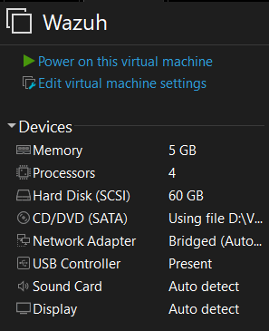
1. Download **Ubuntu Server 26.04 LTS** ISO from [ubuntu.com](https://ubuntu.com/download/server)
2. Create a new VM in VirtualBox/VMware with the specifications above
3. Mount the ISO and boot the VM
4. Follow the installation wizard:
   - Select language and keyboard layout
   - Configure network interface (Bridged Adapter — DHCP or static IP)
   - Set up storage (use entire disk)
   - Create user account (e.g., `socadmin`)
   - Enable **OpenSSH Server** during installation
   - Complete installation and reboot
5. Post-installation:
   ```bash
   sudo apt update && sudo apt upgrade -y
   sudo hostnamectl set-hostname wazuh-server
   ip a    # Note the IP address for later use
   ```

The following screenshots show the Ubuntu Server installation process in the chronological order of execution:

<details>
<summary>📸 Click to expand the step-by-step Ubuntu Server installation screenshots</summary>
<br>

### 1. Language Selection
.png)

### 2. Keyboard Configuration
.png)

### 3. Installation Type Selection
.png)

### 4. Network Interface Configuration (DHCP IP allocation)
.png)

### 5. Ubuntu Archive Mirror Configuration
.png)

### 6. Guided Storage Layout Configuration (Initial 45GB allocation)
.png)

### 7. File System Summary Confirmation
.png)

### 8. User Profile & Server Hostname Configuration (`wazuh`)
.png)

### 9. OpenSSH Server Installation Setting
.png)

### 10. Installation Complete and Reboot Prompt
.png)

### 11. Initial SSH Login & Shell Verification
.png)

### 12. Execution of the Wazuh Installation Script
.png)

### 13. Retried Storage Configuration (Adjusted to 60GB disk allocation)
.png)

### 14. Retried Storage Summary (60GB disk verification)
.png)

### 15. Profile Setup (Set to Wazuh-Server credentials)
.png)

</details>

---

### 2. Windows Endpoint Setup

> **VM Specifications:** 3 GB RAM | 4 vCPUs | 50 GB Storage | Bridged Adapter

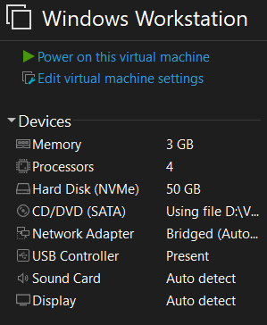
1. Download **Windows 10** ISO from [Microsoft](https://www.microsoft.com/en-us/software-download/windows10)
2. Create a new VM with the specifications above
3. Install Windows 10 with default settings
4. Post-installation:
   - Disable Windows Defender real-time protection (for lab purposes)
   - Set network to **Private**
   - Enable **Remote Desktop** (optional)
   - Note the IP address: `ipconfig`
   - Rename PC: `Settings → System → About → Rename this PC` (e.g., `WIN-ENDPOINT`)

> **Warning:** Only disable security features in isolated lab environments. Never do this on production systems.

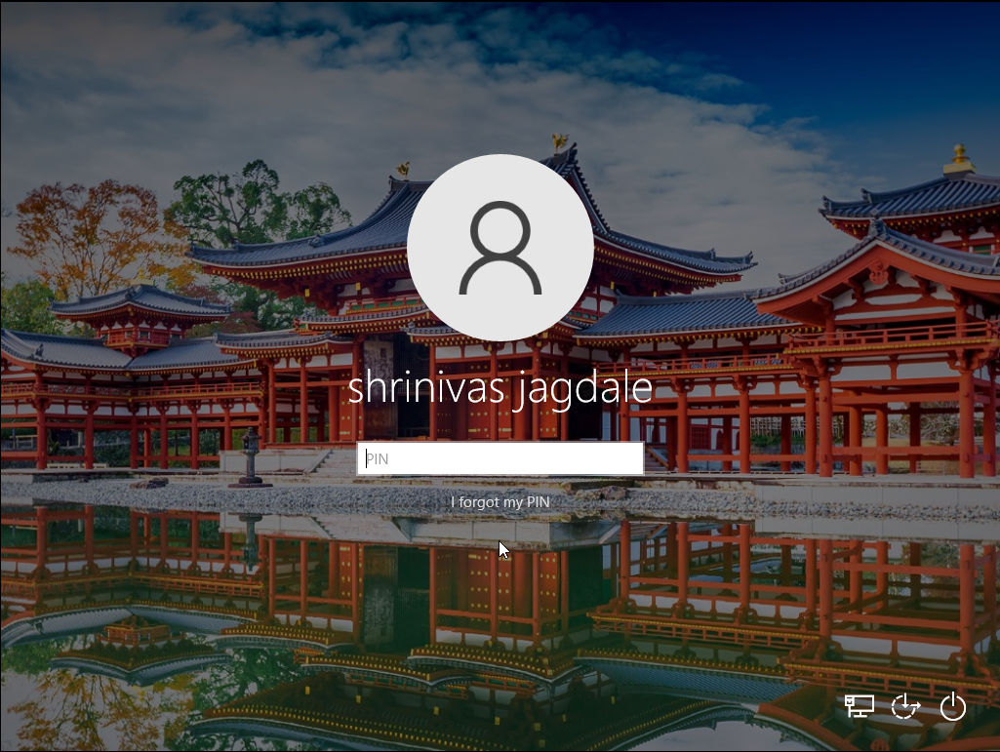
---

### 3. Ubuntu Endpoint Setup

> **VM Specifications:** 3 GB RAM | 3 vCPUs | 25 GB Storage | Bridged Adapter


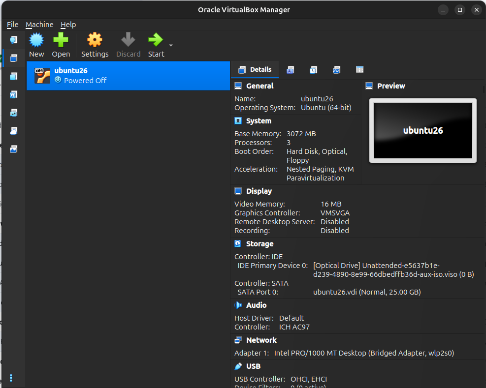
1. Download **Ubuntu Desktop 26.04 LTS** from [ubuntu.com](https://ubuntu.com/download/desktop)
2. Create a new VM with the specifications above
3. Install Ubuntu Desktop with default settings
4. Post-installation:
   ```bash
   sudo apt update && sudo apt upgrade -y
   sudo hostnamectl set-hostname ubuntu-endpoint
   ip a    # Note the IP address
   ```
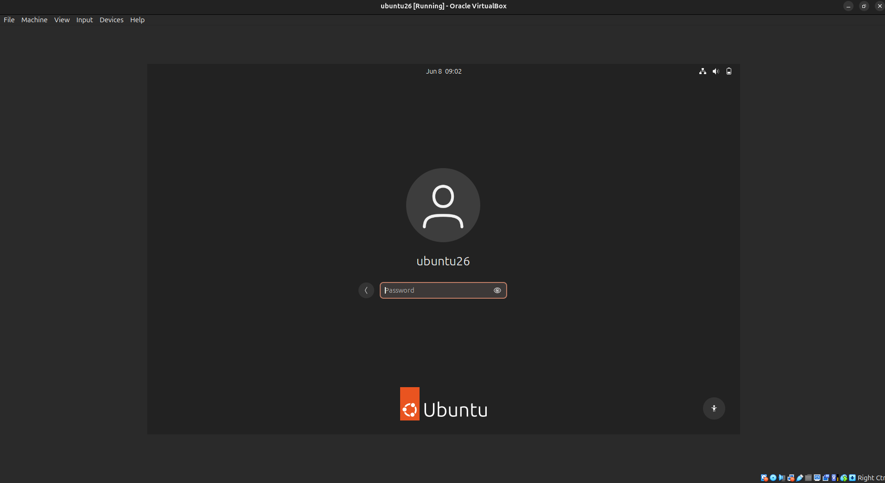
---

### 4. Kali Linux Setup

> **VM Specifications:** 4 GB RAM | 2 vCPUs | 25 GB Storage | Bridged Adapter

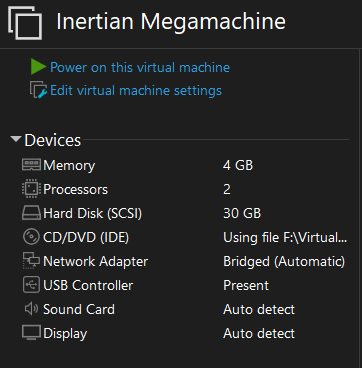
1. Download **Kali Linux 2025.2** from [kali.org](https://www.kali.org/get-kali/)
2. Use the pre-built VM image (recommended) or install from ISO
3. Import/create the VM with the specifications above
4. Post-installation:
   ```bash
   sudo apt update && sudo apt upgrade -y
   ip a    # Note the IP address
   ```
5. Verify attack tools:
   ```bash
   nmap --version
   hydra -h
   msfconsole --version
   nikto -Version
   ```

---

### 5. Wazuh Installation

SSH into the Wazuh Server (Ubuntu Server VM) and execute:

```bash
# Download and run the Wazuh installation assistant
curl -sO https://packages.wazuh.com/4.14/wazuh-install.sh
sudo bash ./wazuh-install.sh -a
```
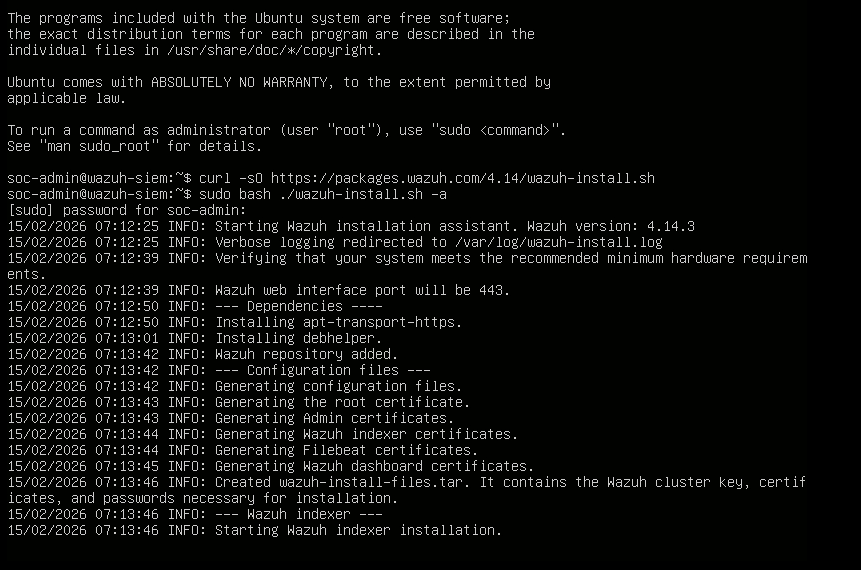

> **Important:** Save the generated admin credentials displayed at the end of installation.

---

### 6. Wazuh Dashboard Access

1. Open a browser and navigate to: `https://192.168.1.13`
2. Log in with the credentials from the installation output
3. Accept the self-signed certificate warning
4. Verify the dashboard loads successfully

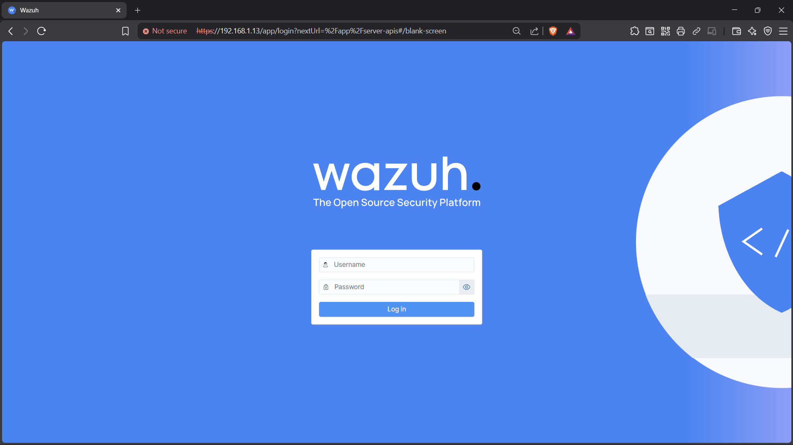

---

### 7. Agent Enrollment

From the Wazuh Dashboard:

1. Navigate to **Agents → Deploy New Agent**
2. Select the appropriate OS for each endpoint
3. Copy the enrollment command
4. Specify the Wazuh server address


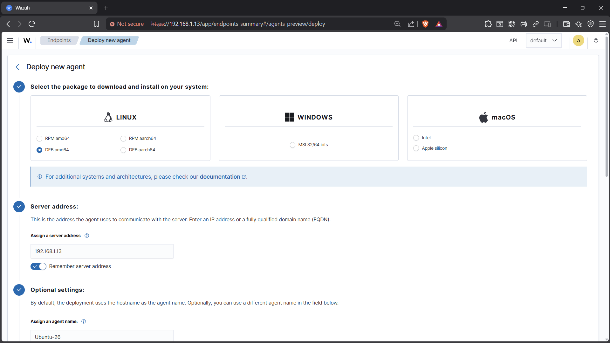
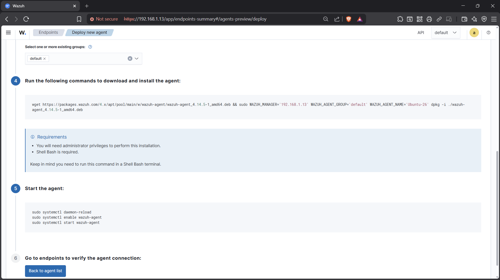
---

### 8. Wazuh Agent Installation on Windows

On the Wazuh/Ubuntu-Server terminal:

```
sudo /var/ossec/bin/manage_agents
```
1. After that select A to add a new agent.
2. Fill the necessary details.
3. Press O to get the Enrollment key of the agent.
4. Copy the key and use it in Windows VM Wazuh agent.

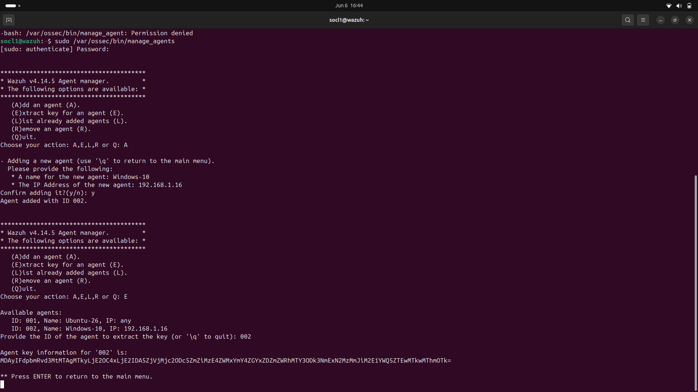

On the **Windows 10 Endpoint**:

1. Download the Wazuh agent MSI installer from the Wazuh Dashboard or:
   ```powershell
   Invoke-WebRequest -Uri https://packages.wazuh.com/4.x/windows/wazuh-agent-4.9.0-1.msi -OutFile wazuh-agent.msi
   ```
2. In the GUI, add the Manager server IP and the Enrollment Key
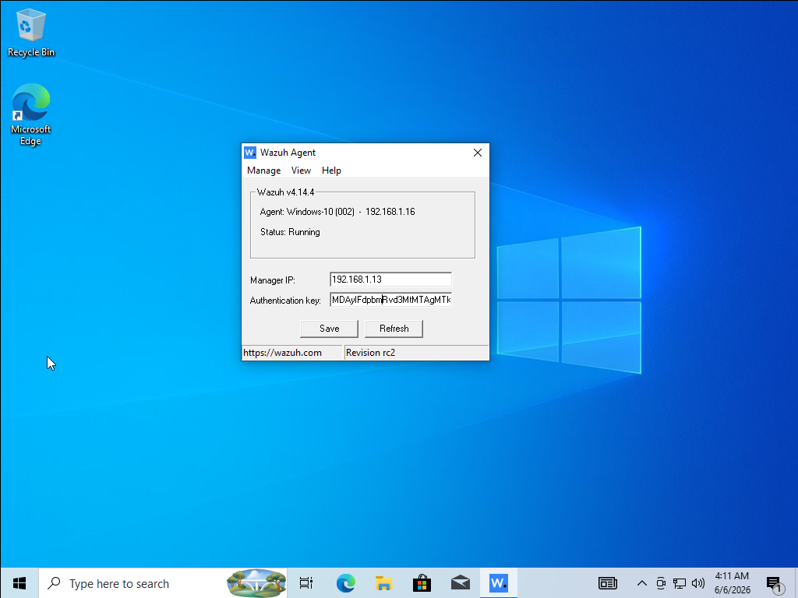
3. Start the agent service:
   ```powershell
   NET START Wazuh
   ```
4. Verify in Wazuh Dashboard → Agents

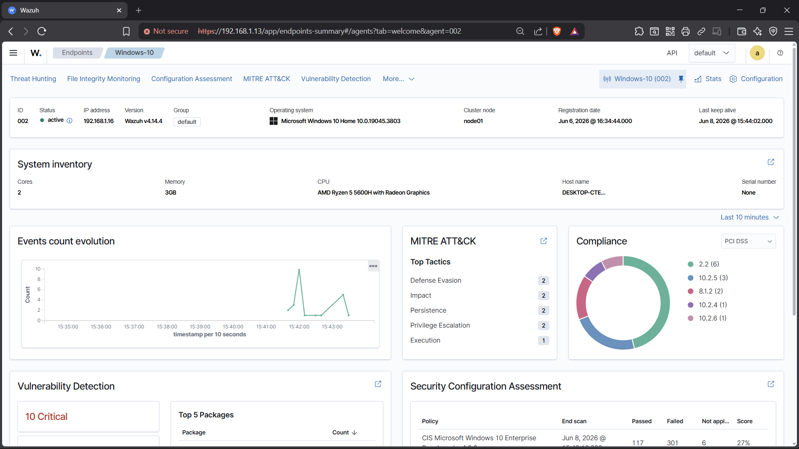
---

### 9. Sysmon Installation

On the **Windows 10 Endpoint**:

1. Download Sysmon from [Sysinternals](https://learn.microsoft.com/en-us/sysinternals/downloads/sysmon):
   ```powershell
   Invoke-WebRequest -Uri https://download.sysinternals.com/files/Sysmon.zip -OutFile Sysmon.zip
   Expand-Archive Sysmon.zip -DestinationPath C:\Sysmon
   ```
2. Download the Sysmon configuration file (SwiftOnSecurity):
   ```powershell
   Invoke-WebRequest -Uri https://raw.githubusercontent.com/SwiftOnSecurity/sysmon-config/master/sysmonconfig-export.xml -OutFile C:\Sysmon\sysmonconfig.xml
   ```
3. Install Sysmon:
   ```powershell
   C:\Sysmon\Sysmon64.exe -accepteula -i C:\Sysmon\sysmonconfig.xml
   ```

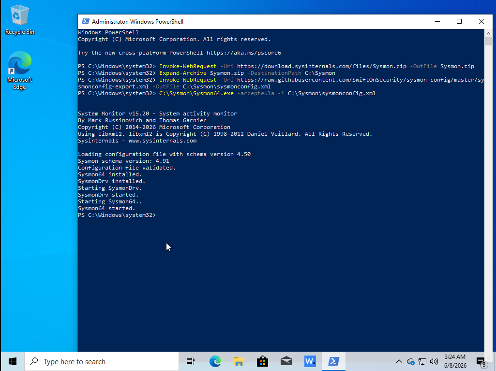
---

### 10. Sysmon Configuration

Configure Wazuh to collect Sysmon logs by editing the Wazuh agent configuration:

```xml
<!-- Add to C:\Program Files (x86)\ossec-agent\ossec.conf -->
<ossec_config>
  <localfile>
    <location>Microsoft-Windows-Sysmon/Operational</location>
    <log_format>eventchannel</log_format>
  </localfile>
</ossec_config>
```

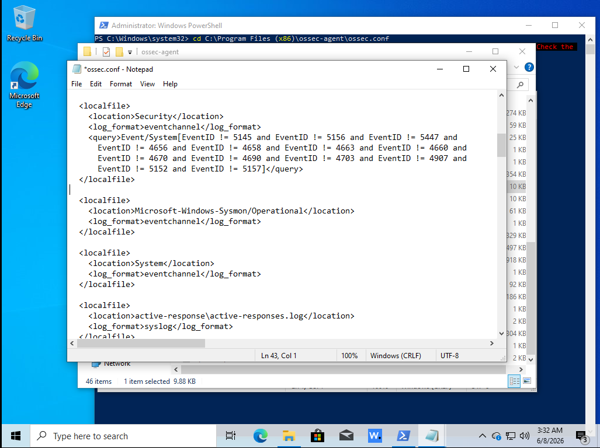

Restart the Wazuh agent:

```powershell
NET STOP Wazuh
NET START Wazuh
```

> **Sysmon Event IDs of Interest:**

| Event ID | Description |
|---|---|
| 1 | Process Creation |
| 3 | Network Connection |
| 7 | Image Loaded |
| 8 | CreateRemoteThread |
| 11 | File Created |
| 12/13/14 | Registry Events |
| 15 | FileCreateStreamHash |
| 22 | DNS Query |
| 25 | Process Tampering |

---

### 11. Wazuh Agent Installation on Ubuntu

On the **Ubuntu Desktop Endpoint**:

```bash
# Import the Wazuh repository GPG key
curl -s https://packages.wazuh.com/key/GPG-KEY-WAZUH | sudo gpg --no-default-keyring --keyring gnupg-ring:/usr/share/keyrings/wazuh.gpg --import && sudo chmod 644 /usr/share/keyrings/wazuh.gpg

# Add the Wazuh repository
echo "deb [signed-by=/usr/share/keyrings/wazuh.gpg] https://packages.wazuh.com/4.x/apt/ stable main" | sudo tee /etc/apt/sources.list.d/wazuh.list

# Install the agent
sudo apt update
sudo WAZUH_MANAGER="<WAZUH_SERVER_IP>" WAZUH_AGENT_NAME="UBUNTU-ENDPOINT" apt install wazuh-agent -y

# Enable and start the agent
sudo systemctl daemon-reload
sudo systemctl enable wazuh-agent
sudo systemctl start wazuh-agent

# Verify status
sudo systemctl status wazuh-agent
```
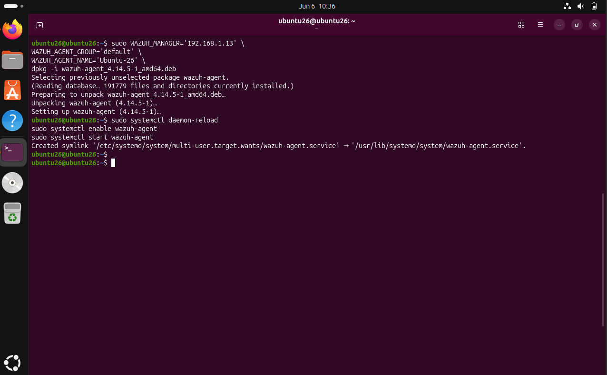
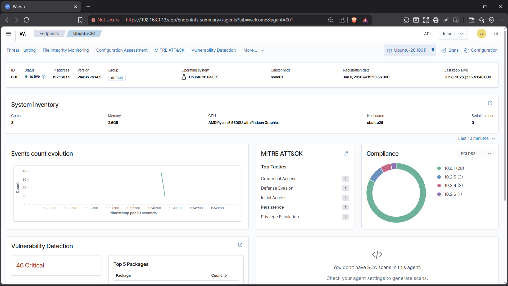
---

### 12. Verification Steps

| Component | Verification Command | Expected Result |
|---|---|---|
| Wazuh Manager | `sudo systemctl status wazuh-manager` | Active (running) |
| Wazuh Indexer | `sudo systemctl status wazuh-indexer` | Active (running) |
| Wazuh Dashboard | `https://<IP>:443` | Login page accessible |
| Windows Agent | `NET START \| findstr Wazuh` | Wazuh service running |
| Ubuntu Agent | `sudo systemctl status wazuh-agent` | Active (running) |
| Sysmon | `Get-Service Sysmon64` | Running |
| Agent Enrollment | Wazuh Dashboard → Agents | All agents visible & active |

---

### 13. Troubleshooting

| Issue | Solution |
|---|---|
| Agent not connecting to manager | Verify firewall rules: allow port `1514/TCP` and `1515/TCP` on Wazuh server |
| Dashboard not loading | Check if `wazuh-indexer` and `wazuh-dashboard` services are running |
| Sysmon events not appearing | Verify `ossec.conf` includes Sysmon eventchannel; restart agent |
| VMs can't communicate | Ensure all VMs use **Bridged Adapter** and are on the same subnet |
| Agent shows "Disconnected" | Restart agent service; check manager IP in `ossec.conf` |
| High CPU on Wazuh Server | Increase allocated RAM/CPU; check indexer heap size |
| Logs not forwarding | Check agent `ossec.log` for errors: `/var/ossec/logs/ossec.log` |

---

## ⚔️ Attack Simulations

### Windows Endpoint Attacks

| # | Attack Scenario | MITRE Tactic | Key Technique |
|---|---|---|---|
| 1 | [Nmap Reconnaissance Scan](windows-endpoint/Attacks/attack-01-nmap-scan-README.md) | Reconnaissance | T1046 – Network Service Scanning |
| 2 | [Brute-Force Attack](windows-endpoint/Attacks/attack-02-bruteforce-README.md) | Credential Access | T1110 – Brute Force |
| 3 | [PowerShell Execution](windows-endpoint/Attacks/attack-03-powershell-execution-README.md) | Execution | T1059.001 – PowerShell |
| 4 | [Persistence Mechanism](windows-endpoint/Attacks/attack-04-persistence-README.md) | Persistence | T1053 – Scheduled Task/Job |
| 5 | [Privilege Escalation](windows-endpoint/Attacks/attack-05-privilege-escalation-README.md) | Privilege Escalation | T1548 – Abuse Elevation Control |

### Ubuntu Endpoint Attacks

| # | Attack Scenario | MITRE Tactic | Key Technique |
|---|---|---|---|
| 1 | [Nmap Reconnaissance Scan](ubuntu-endpoint/Attacks/attack-01-nmap-scan-README.md) | Reconnaissance | T1046 – Network Service Scanning |
| 2 | [SSH Brute-Force Attack](ubuntu-endpoint/Attacks/attack-02-ssh-bruteforce-README.md) | Credential Access | T1110.001 – Password Guessing |
| 3 | [Privilege Escalation](ubuntu-endpoint/Attacks/attack-03-privilege-escalation-README.md) | Privilege Escalation | T1548.003 – Sudo and Sudo Caching |
| 4 | [Persistence Mechanism](ubuntu-endpoint/Attacks/attack-04-persistence-README.md) | Persistence | T1053.003 – Cron |
| 5 | [Suspicious File Activity](ubuntu-endpoint/Attacks/attack-05-suspicious-file-activity-README.md) | Collection | T1005 – Data from Local System |

---

## Skills Demonstrated

| Skill Area | Description |
|---|---|
| **SOC Operations** | Tier 1/Tier 2 alert triage, investigation, and escalation workflows |
| **Detection Engineering** | Custom Wazuh rule creation, alert tuning, and false positive reduction |
| **Threat Hunting** | Proactive search for indicators of compromise across endpoints |
| **Incident Response** | Structured investigation, containment, and documentation |
| **SIEM Administration** | Wazuh deployment, agent management, and dashboard configuration |
| **Linux Administration** | Ubuntu server management, service configuration, and log analysis |
| **Windows Security Monitoring** | Event log analysis, Sysmon telemetry, and endpoint hardening |
| **Log Analysis** | Parsing and correlating Windows Event Logs, Sysmon, and syslog |
| **MITRE ATT&CK Mapping** | Technique identification, tactic classification, and coverage analysis |
| **Network Security** | Network reconnaissance detection, traffic analysis, and segmentation |

---

## License

This project is for **educational and portfolio purposes only**. All attack simulations are performed in an isolated lab environment. Do not use these techniques against systems without explicit authorization.

---


## Author

**Your Name**
- GitHub: [@siriin4k](https://github.com/Siriin4k)
- LinkedIn: [Shreenivas Jagdale](https://linkedin.com/in/siriin4k)
- Github: [@monkencrypts](https://github.com/monkencrypts)
- LinkedIn: [Kartik Manurkar](https://linkedin.com/in/kartik-manurkar)
---

<p align="center">
  <em>Built with passion for cybersecurity and continuous learning.</em>
</p>
